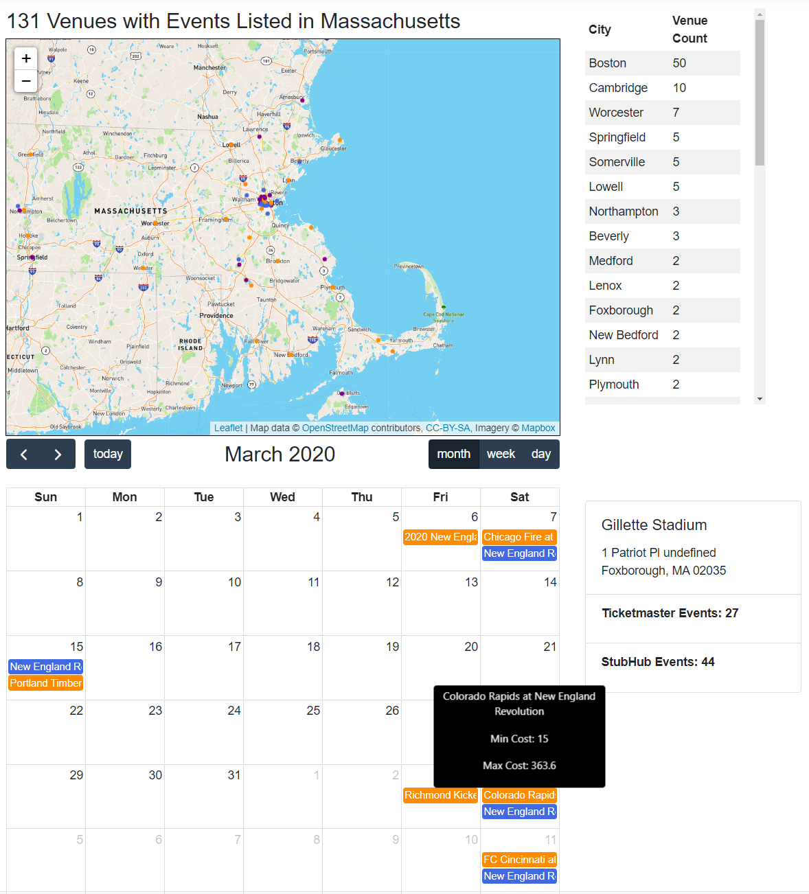

# concertTicketWebCore
ASP.NET Core Website for Data Exploration and Analysis of Event Ticket Data in Massachusetts

This website is the result of getting gouged by a ticket scalper. And needing a portfolio for my upcoming job search.

Data in the MSSQL Server DB was collected from various ticket vendor APIs (for now just Ticketmaster and Stubhub).
The scriptes in my other repo "ticketDataCollection" contain python scripts to save new json data from the APIs to file and archive old files; It also contains .NET Core Console Apps (Set on Scheduled Routine in the Windows Task Manager) to run those python scripts and T-SQL statements saving the new json files to relational tables in the DB. By doing this we have longitudinal data that later can be used
to examine price fluxutation. 

This ASP.NET Core 3.1 website utilizes various tools including but not limited to 
D3.js(Low Level General Data Visualization)
, React(More responsive UI/UX)
, Leaflet(Visualizing Geo-Data)
, Plotly(General High Level Data Visualization)
, React-Pivottable(Exploratory Data Analysis)
, Full-Calendar(Plotting of TimeSeries Event Data)

Please note that this is a work in progress as such
  -styling will be fine tuned once everything else is in order
  -more security measures will be taken once the site is deployed
